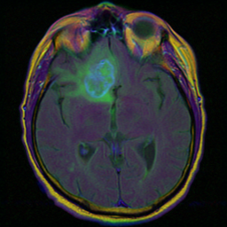

# CerebroNet

[Портфолио](https://jellywilliam.github.io)

[Ссылка на репозиторий](https://github.com/JellyWilliam/CerebroNet)

# Набор данных

[Brain MRI segmentation](https://www.kaggle.com/datasets/mateuszbuda/lgg-mri-segmentation)
представляет собой набор из изображений МРТ головного мозга и изображений масок с аномальными участками

Пример данных:

**МРТ**



**Маска**


# Анализ табличных данных

Более подробно об анализе можно просмотреть в ноутбуке [Анализ](Анализ.ipynb)

В ходе анализа, несмотря на низкую корреляцию между переменными, удалось найти некоторые взаимосвязи.

# Архитектура

Реализована функция получения сконфигурированной модели для обучения (deeplabv3_mobilenet_v3_large, deeplabv3_resnet50,
deeplabv3_resnet101, fcn_resnet50, fcn_resnet101, lraspp_mobilenet_v3_large) и предобработчика изображений по умолчанию

```python
def get_image_segmentation_model(name: str,
                                 pretrained: bool = True,
                                 freeze_weight: bool = False,
                                 num_classes: int = 1):
    """
    Функция получения сконфигурированного сегментатора изображений

    :param name: название модели
    :param pretrained: загружать веса Imagenet1K
    :param freeze_weight: замораживать все слои, кроме последнего
    :param num_classes: количество выходных классов

    :return: tuple(модель, трансформер изображения)
    """
    valid_model_name(name)

    models_package = segmentation.__dict__

    last_layer_name = last_layer_replace_dict[name]
    import_name = get_models_dict[name]
    weight_name = get_weights_dict[f"{import_name}_weights"]

    weights = models_package[weight_name].DEFAULT

    model = models_package[import_name](weights=weights if pretrained else None)

    if freeze_weight:
        for param in model.parameters():
            param.requiresGrad = False

    if name == "lraspp_mobilenet_v3_large":
        in_channels_low = model.classifier.low_classifier.in_channels
        model.classifier.low_classifier = nn.Conv2d(in_channels=in_channels_low,
                                                    out_channels=num_classes,
                                                    kernel_size=(1, 1),
                                                    stride=(1, 1))

        in_channels_high = model.classifier.high_classifier.in_channels
        model.classifier.high_classifier = nn.Conv2d(in_channels=in_channels_high,
                                                     out_channels=num_classes,
                                                     kernel_size=(1, 1),
                                                     stride=(1, 1))

        return model, weights.transforms()

    if pretrained:
        for layer in last_layer_name:
            if "." not in layer:
                in_features = model._modules[layer].in_features
                model._modules[layer] = nn.Linear(in_features=in_features, out_features=num_classes)

            else:
                last_layer_arr = layer.split(".")

                try:
                    last_layer_arr[1] = int(last_layer_arr[1])
                except ValueError:
                    last_layer_arr[1] = 0

                in_channels = model._modules[last_layer_arr[0]][last_layer_arr[1]].in_channels
                model._modules[last_layer_arr[0]][last_layer_arr[1]] = nn.Conv2d(in_channels=in_channels,
                                                                                 out_channels=num_classes,
                                                                                 kernel_size=(1, 1),
                                                                                 stride=(1, 1))
    else:
        last_layer_name = last_layer_name[0]

        if "." not in last_layer_name:
            in_features = model._modules[last_layer_name].in_features
            model._modules[last_layer_name] = nn.Linear(in_features=in_features, out_features=num_classes)

        else:
            last_layer_arr = last_layer_name.split(".")

            try:
                last_layer_arr[1] = int(last_layer_arr[1])
            except ValueError:
                last_layer_arr[1] = 0

            in_channels = model._modules[last_layer_arr[0]][last_layer_arr[1]].in_channels
            model._modules[last_layer_arr[0]][last_layer_arr[1]] = nn.Conv2d(in_channels=in_channels,
                                                                             out_channels=num_classes,
                                                                             kernel_size=(1, 1),
                                                                             stride=(1, 1))
    return model, weights.transforms()
```

## Обучение

В пакете [utils](utils) реализованы метрики Pixelwise Acc. и Mean IoU, а также функции потерь: DiceLoss, FocalLoss,
JaccardLoss, которых нет в Torch

В ноутбуке [Обучение модели.ipynb](Обучение%20модели.ipynb) реализованы все этапы обучения модели.

Для упрощения конфигурации модели в данном ноутбуке имеется ячейка, представленная ниже

```python
# Устройство, на котором будут происходить все вычисления
device = "cuda" if torch.cuda.is_available() else "cpu"

# Пути до датасета
dataset_path = "D:/ProjectsData/Brain MRI segmentation/kaggle_3m"

# Имя базовой модели для классификатора изображений
image_model_type = "deeplabv3_resnet101"
# Функция потерь (BCEWithLogitsLoss, DiceLoss, FocalLoss, JaccardLoss)
criterion_name = "JaccardLoss"
# Название оптимизатора (Adam, AdamW)
optimizer_name = "AdamW"
# Количество предсказываемых классов
num_classes = 1
# Загрузка весов модели
pretrained = True
# Заморозка весов модели (кроме последних слоёв)
freeze_weight = False

# Количество обучающих эпох
num_epochs = 10
# Размер батча при обучении
batch_size = 12

# Пути сохранения и загрузки чекпоинта
save_path = "./deeplabv3_resnet101.pth"
checkpoint_path = "./deeplabv3_resnet101.pth"
```

## Веса модели

Вы можете загрузить веса **_deeplabv3_resnet101_** по данной [ссылке](https://drive.google.com/file/d/1a8cncF0kSGEZK9saVuorTik3SkEwsXCi/view?usp=sharing)
